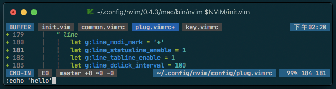

# VIM CLINES

simple statusline & tabline



## options

```options
default_options
  let g:line_modi_mark = '+'
  let g:line_statusline_enable = 1
  let g:line_tabline_enable = 1
  let g:line_dclick_interval = 100

default_color
  hi LineColor1 ctermbg=24
  hi LineColor2 ctermbg=238
  hi LineColor3 ctermbg=25
  hi LineColor4 ctermbg=NONE
```
